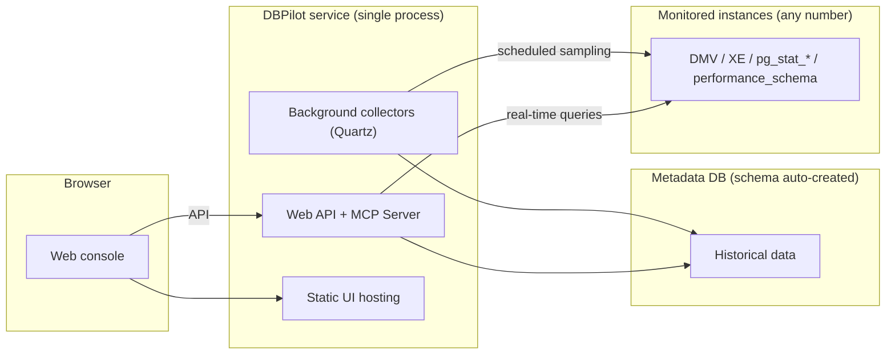

# DBPilot

**Self-hosted database autonomous diagnostics platform**.

[](https://www.nuget.org/packages/DBPilot)
[](https://www.nuget.org/packages/DBPilot)
[](LICENSE.txt)
[](https://dotnet.microsoft.com/download/dotnet/10.0)
[](#engine-support-matrix)

DBPilot continuously samples your database instances and turns the data into the day-to-day DBA workflow in a single web console: performance trends, performance insight (AAS load decomposition), Top SQL, query plan change tracking, missing-index advice, index usage & fragmentation, blocking analysis, deadlock analysis, and slow query logs.

[简体中文](README.zh-CN.md)


## Contents

- [Highlights](#highlights)
- [Screenshots](#screenshots)
- [Quick start](#quick-start)
- [Password and master key](#password-and-master-key)
- [Building from source](#building-from-source)
- [Architecture](#architecture)
- [Features](#features)
- [Engine support matrix](#engine-support-matrix)
- [AI diagnostics (MCP Server)](#ai-diagnostics-mcp-server)
- [Overhead on monitored instances](#overhead-on-monitored-instances)
- [Configuration (appsettings.json)](#configuration-appsettingsjson)
- [Embedding via NuGet](#embedding-via-nuget)
- [FAQ](#faq)
- [License](#license)

## Highlights

- **Single-process deployment** — one .NET 10 process + one metadata database (schema auto-created on startup). Choose SQL Server, MySQL, PostgreSQL or SQLite as the metadata store.
- **Monitors three engines** — SQL Server 2008–2022, MySQL 8.0+, PostgreSQL 13+. Monitoring engine and metadata-store engine are independent axes and can be combined freely (e.g. monitor SQL Server while storing history in PostgreSQL).
- **Very low overhead** — <1% CPU on monitored instances in normal operation. Only in-memory metadata views (DMVs / `pg_stat_*` / `performance_schema`) are read; business tables are never scanned. See [Overhead on monitored instances](#overhead-on-monitored-instances).
- **AI-ready** — built-in read-only MCP Server exposes 11 diagnostic tools to AI agents (Claude Code, Codex CLI, ...), so you can ask questions like *"did anything slow down on this instance in the last hour?"*
- **Capability-driven UI** — features without an equivalent data source on a given engine are hidden or degraded automatically (e.g. PostgreSQL gets a deadlock *trend* instead of deadlock event details); the API answers with explicit, actionable messages.

## Screenshots

| Performance insight (AAS) | Performance trends |
|---|---|
|  |  |

| Deadlock analysis | Deadlock event detail |
|---|---|
|  |  |

| Blocking analysis | Blocking chain detail |
|---|---|
|  |  |

| Index usage | Slow query log |
|---|---|
|  |  |

## Quick start

The fastest path is the NuGet packages (frontend assets are embedded — no Node.js needed). Requires .NET SDK 10.0+. Five steps:

1. Create a host project and add the metapackage (AspNetCore + all four engine packages):

```bash
mkdir dbpilot-demo && cd dbpilot-demo
dotnet new web
dotnet add package DBPilot
```

> Don't name your host project `dbpilot` (or `DBPilot.*`) — the name would collide with the NuGet package and restore fails with NU1108 (cycle detected).

2. Replace `Program.cs` with:

```csharp
using DBPilot.AspNetCore.Extension;
using DBPilot.Core.Providers;

var builder = WebApplication.CreateBuilder(args);
builder.AddDBPilot(o => o.PlatformEngine = DbpilotEngine.Sqlite);  // metadata-store engine: SQLite, zero external dependencies

var app = builder.Build();
app.UseDBPilot();
app.Run();
```

3. Replace `appsettings.json` with (SQLite flavor; replace the placeholders):

```json
{
  "Serilog": {
    "MinimumLevel": {
      "Default": "Information",
      "Override": { "Microsoft": "Warning", "System": "Warning" }
    }
  },
  "DBPilot": {
    "ConnectionString": "Data Source=dbpilot_platform.db",
    "Mcp": { "ApiKey": "<random key; non-empty enables MCP, empty = off>" },
    "Auth": {
      "Username": "admin",
      "PasswordHash": "pbkdf2$100000$IOaBWezPYRnzEbBWYwLxZA==$xBWm8jjDfanDmyRttfnZoG4MIk8lcF0UnDbpjJuWaEU=",
      "Secret": "<your master key (>= 32-char random string)>"
    }
  },
  "AllowedHosts": "*"
}
```

A few notes: `ConnectionString` and `Auth:Secret` are the two required keys (the SQLite file and schema are created automatically on startup; the master key signs login cookies and encrypts instance credentials — startup fails without it, see [Password and master key](#password-and-master-key) for generating one); the `PasswordHash` above is the hash of the default password `dbpilot@2026` — keep it to log in with the default password; `Mcp:ApiKey` empty = MCP off.

4. Run:

```bash
dotnet run    # → http://localhost:5000
```

5. Open the site and log in with the default account `admin` / `dbpilot@2026` (**change it after deployment** — see [Password and master key](#password-and-master-key)), then register your first monitored instance: **Instances → Add** (host + credentials, stored encrypted) → Test connection → Enable. Real-time pages work immediately; history accumulates over time.

### SQL Server as the metadata store

Switching the metadata-store engine changes exactly two things (`PlatformEngine` and the connection string; everything else stays. MySQL / PostgreSQL work the same way via `DbpilotEngine.MySql` / `DbpilotEngine.PostgreSql`):

```csharp
builder.AddDBPilot(o => o.PlatformEngine = DbpilotEngine.SqlServer);
```

```json
"ConnectionString": "Server=<your-host>,1433;Initial Catalog=dbpilot;User Id=<user>;Password=<password>;Max Pool Size=20;Encrypt=False;TrustServerCertificate=True"
```

The connection string may point at an empty database (existing, or an account allowed to create one); the schema is created automatically on startup.

> SQLite as the metadata store is for zero-dependency out-of-the-box setup — fine for evaluation and single-machine lightweight deployments (no multi-process Roles). For long-term/production use prefer SQL Server / MySQL / PostgreSQL: switching later only changes `PlatformEngine` and the connection string. The metadata-store engine and monitored engines are independent axes; already-registered instances are unaffected.
> Ready-made hosts for this setup live in [`samples/`](samples/) (SqlServer :5200 / MySql :5201 / Sqlite :5203 / PostgreSql :5204) — see [Building from source](#building-from-source).

## Password and master key

**Change the login password**: passwords are stored as PBKDF2 hashes (`pbkdf2$iterations$salt$hash`) in `DBPilot:Auth:PasswordHash` — changing the password means replacing that hash. Three steps:

1. In a directory **without a project file** (your home or a temp directory), create a two-line `hash.cs`. **Do not put it inside dbpilot-demo or any project directory** — there `dotnet run` runs the project and `hash.cs` is passed to it as an argument:

```csharp
#:package DBPilot.Core@0.5.3
Console.WriteLine(DBPilot.Core.Auth.PasswordHasher.Hash(args[0]));
```

2. Run it in that directory; the whole output line is the hash of your new password:

```bash
dotnet run hash.cs <new-password>
```

3. Paste that line into `DBPilot:Auth:PasswordHash` in `appsettings.json` (replacing the old value), restart to apply.

If you cloned the repository, skip the three steps: `dotnet run --project samples/DBPilot.Sample.SqlServer -- --hash <new-password>` (any of the four samples works).

**Master key (`Auth:Secret` or env `DBPILOT_MASTER_KEY` — either one, required)** — used for exactly two things:

| Purpose | What it does | If you change the key |
|---|---|---|
| Login-cookie signing | issues/validates login tickets (HMAC-SHA256) | all sessions logged out; just log in again |
| Instance-credential encryption | monitored instances' passwords are stored AES-256-GCM-encrypted in the metadata DB and decrypted by collectors on connect | **old ciphertext becomes undecryptable — no recovery**; re-enter each instance's connection password in the UI |

That is why startup fails without it (prevents "run first, configure later" leaving instance credentials permanently undecryptable), and why you should **not change it once in use**. Generate one on the spot:

```bash
openssl rand -base64 32                                    # Linux / macOS / Git Bash
# PowerShell: [guid]::NewGuid().ToString("N") + [guid]::NewGuid().ToString("N")
```

## Building from source

Build and run from source. Compared to the NuGet path this additionally requires **Node.js 20+** (the embedded web UI is produced by the frontend build; output is not committed to git, NuGet packages ship it prebuilt). Three steps:

1. Clone the repository and run the one-shot setup (frontend build + compile + sample appsettings.json; default SqlServer host — pass `MySql` / `Sqlite` / `PostgreSql` to switch):

```bash
git clone https://github.com/SkyChenSky/DBPilot.git
cd DBPilot
scripts\run\setup.bat
```

2. Edit `samples/DBPilot.Sample.SqlServer/appsettings.json` — fill in the connection string and `Auth:Secret`.

3. Start:

```bash
dotnet run --project samples/DBPilot.Sample.SqlServer    # → http://localhost:5200
```

The frontend build is needed once after cloning, and again only when the frontend changes. On non-Windows (or run manually), step 1 is equivalent to:

```bash
cd web && npm install && npm run build
cd .. && dotnet build
cp samples/DBPilot.Sample.SqlServer/appsettings.template.json samples/DBPilot.Sample.SqlServer/appsettings.json
```

Day-to-day development (backend hot-reload + frontend dev server):

```bash
scripts\run\dev.bat      # or two terminals:
dotnet watch --project samples/DBPilot.Sample.SqlServer   # backend (Swagger at /swagger)
cd web && npm run dev                                     # frontend → http://localhost:5173
```

- `scripts\run\test.bat` — build + unit tests + frontend build in one go
- `scripts/test/` — self-test load scripts (SQL Server / MySQL; generate load → verify → clean up). **Never run them against production databases.** See `scripts/README.md`

## Architecture



The browser talks only to the DBPilot service. Real-time pages query instances directly; history pages read the metadata DB — both paths share the same data conventions (noise exclusion, statement fingerprinting, time windows).

## Features

| Page | What it answers |
|---|---|
| **Overview** | Instance health at a glance: key metric cards with sparklines, recent critical events, Top SQL digest |
| **Performance trends** | CPU / memory / PLE / QPS·TPS / IO / disk, 10s granularity (30-day retention, auto down-sampling for long ranges); optional event overlay (deadlocks / slow SQL / plan changes as dashed vertical lines) |
| **Performance insight** | Average Active Sessions (AAS) decomposed into CPU / lock / IO / waits — find which resource is saturated, drill down to the SQL statements contributing load |
| **Top SQL** | Real-time leaderboard + history trends, statements merged by fingerprint; one-click noise exclusion (global cross-instance blacklist) |
| **Query plans** | Plan versions snapshotted automatically; plan changes raise events with before/after resource comparison, plan tree and XML |
| **Missing indexes** | Optimizer recommendations ranked by impact, with CREATE scripts and overlap/merge hints |
| **Index usage / fragmentation** | Read/write counters to spot unused indexes (with drop scripts); fragmentation scan with REBUILD / REORGANIZE scripts |
| **Blocking analysis** | Real-time blocking tree (head blocker, chain, wait times) + historical statistics and trends |
| **Deadlock analysis** | Deadlock events captured automatically; graph view of the cycle, statements, and lock relationships |
| **Slow query log** | Above-threshold statements archived automatically: full text, duration, IO, fingerprint; filter by time / database |

## Engine support matrix

| Capability | SQL Server | MySQL 8.0+ | PostgreSQL 13+ |
|---|---|---|---|
| Sessions / blocking (real-time tree + history) | ✅ | ✅ | ✅ (`pg_stat_activity` + `pg_blocking_pids`) |
| Top SQL (fingerprinted) | ✅ | ✅ (`performance_schema` digest) | ✅ (`pg_stat_statements`) |
| Slow query log | ✅ (XE events) | ✅ (`mysql.slow_log` table) | ◐ template leaderboard (no SQL-channel slow log) |
| Performance trends | ✅ | ◐ (no OS CPU/memory, PLE, compile counters) | ◐ (QPS is transaction-scope: `xact_commit + xact_rollback`) |
| Deadlock analysis | ✅ event details + graph | ❌ | ◐ trend only (`pg_stat_database.deadlocks`) |
| Query plan snapshots / change tracking | ✅ | ❌ | ❌ |
| Missing index advice | ✅ | ❌ | ❌ |
| Index usage | ✅ | ◐ (unused-index detection is conservative due to counter semantics) | ◐ (unused indexes reliably detectable) |
| Fragmentation scan | ✅ | ❌ | ❌ |
| Index disable script | ✅ | ✅ (`INVISIBLE`) | ❌ |
| Disk usage | ✅ volume-level | ◐ database-level capacity | ◐ database-level capacity |

**Metadata store (platform DB)**: SQL Server / MySQL / PostgreSQL / SQLite. Independent from the monitored engines — any combination works (SQLite gives you a single-executable + single-file embedded deployment; see `samples/DBPilot.Sample.Sqlite`).

### Prerequisites by engine

**MySQL (monitored)**: `performance_schema=ON`, an account with `PROCESS` + `SELECT` on `performance_schema`/`mysql`. Slow SQL requires `slow_query_log=ON` and `log_output` containing `TABLE`. On managed MySQL, parameter groups often deviate from defaults in ways that cause *silent empty data* — the connection test checks each parameter and tells you exactly what to change. SP body statements never appear in the digest leaderboard (MySQL design boundary; `CALL` itself does).

**PostgreSQL (monitored)**: account able to read `pg_stat_activity` / `pg_stat_database` / `pg_locks` / `pg_stat_user_indexes` with `CONNECT` on target databases. The single hard requirement is the `pg_stat_statements` extension with `track ≠ none` — without it Top SQL stays empty (the wizard's self-check reports this with fix instructions).

**SQL Server (monitored)**: works from 2008 up. Deadlock capture rides the built-in `system_health` session by default; slow SQL uses an auto-created XE session (or an existing one you configure).

## AI diagnostics (MCP Server)

A read-only MCP Server (`/mcp`, Streamable HTTP + API key) hands the platform's evidence — metrics, slow SQL, deadlocks, blocking, indexes — to AI agents as 11 read-only tools. Tools share the same query conventions as the web UI; SQL text is truncated by default to protect the context window; every call is audit-logged.

Enable it (off by default; a non-empty `ApiKey` is the switch — there is no separate Enabled flag):

```json
"DBPilot": {
  "Mcp": { "ApiKey": "a sufficiently random key" }
}
```

**Claude Code**:

```bash
claude mcp add --transport http dbpilot http://localhost:5200/mcp --header "X-Api-Key: <your-key>"
```

Verify with `claude mcp list` (or `/mcp` in a session), then just ask: *"use dbpilot to check the instance load over the last hour — any SQL getting slower?"*

**Codex CLI** (`~/.codex/config.toml`):

```toml
[mcp_servers.dbpilot]
url = "http://localhost:5200/mcp"

[mcp_servers.dbpilot.http_headers]
X-Api-Key = "<your-key>"
```

See [examples/](examples/) for a command-line diagnostic console (`DBPilot.McpConsole`) and a fault-drill project (`DBPilot.Scenarios`) that reference the published NuGet packages.

## Overhead on monitored instances

**<1% CPU, zero disk pressure in normal operation.** Collectors read in-memory metadata views (DMVs, extended event files, `pg_stat_*`, `performance_schema`) — no business-table scans, no physical IO, no locks on user objects.

| Collector | Frequency | Cost |
|---|---|---|
| Session sampling / instance metrics / Top SQL delta / deadlocks / slow SQL | 10–60s | millisecond-level metadata queries; XE incremental cursors near zero when idle |
| Query plan snapshots | 5 min | plan XML fetched only on first sight of a fingerprint (XML generation is the expensive part) |
| Index snapshots (incl. fragmentation) | daily 03:10 | heaviest tick of the day, deliberately scheduled at night |
| History writes | — | always to the metadata DB, never to monitored instances |

Mitigations built in: XE predicates exclude the platform's own sessions, self-monitoring statements are tagged out of Top SQL, every cron is configurable, instances can be disabled individually, failed connections back off automatically. Sub-second DMV polling is the industry-standard path (SQL Server's own `system_health` and AWS Performance Insights work this way).

You can verify it yourself — after running for a day, the monitoring account's accumulated CPU seconds on the monitored instance is the true cost:

```sql
SELECT login_name, SUM(cpu_time)/1000 AS cpu_seconds_total
FROM sys.dm_exec_sessions
WHERE host_process_id IS NOT NULL
GROUP BY login_name;
```

## Configuration (appsettings.json)

Two required keys + one required value: `DBPilot:ConnectionString`, `DBPilot:PlatformEngine` (enum in code or config key — either form), and a master key (`DBPilot:Auth:Secret` or env `DBPILOT_MASTER_KEY` — either form); missing → startup error. Everything else is optional with sane defaults.

| Key | Required | Notes |
|---|---|---|
| `DBPilot:ConnectionString` | **yes** | Metadata DB connection string; schema auto-created on startup |
| `DBPilot:PlatformEngine` | **yes (one of the two forms)** | `sqlserver` / `mysql` / `postgresql` / `sqlite`. Preferred form in code: `o.PlatformEngine = DbpilotEngine.SqlServer`; config key is read automatically. Determines schema & ORM dialect; **independent of which engines you monitor** |
| `DBPilot:Auth:Secret` | **yes (or the env var)** | Master key: signs login cookies + encrypts instance credentials (AES-GCM); ≥32-char random string; missing → startup error (protects against instance credentials becoming undecryptable after a restart) |
| `DBPILOT_MASTER_KEY` (env) | **yes (or Auth:Secret)** | Environment-variable form of the master key — friendly for containers/secret managers; the config value takes precedence |
| `DBPilot:Auth:Username` / `DBPilot:Auth:PasswordHash` | no | Login username (default `admin`) / password hash (default password `dbpilot@2026`); see [Password and master key](#password-and-master-key) |
| `DBPilot:Mcp:ApiKey` | no | MCP Server switch (non-empty = enabled) |
| `DBPilot:Roles` | no | Process roles (Web / Collector, both by default); multi-process deployment = 1 collector + N web fronts. Two collectors on one metadata DB double-collect |
| `DBPilot:AutoInitSchema` | no | Auto-create schema on startup (default true; set false when your DBA owns the schema) |
| `DBPilot:TopSqlExcludePatterns` | no | Top SQL noise filters (LIKE patterns); defaults built in, explicit `[]` clears them |
| `DBPilot:Jobs` | no | Per-collector switch & cron; explicit empty value disables that collector (the only place to turn collection off) |
| `DBPilot:Retention` / `DBPilot:Collect` | no | Retention days (auto-purged) / parallelism & backoff |

Connection info for *monitored* instances never lives in config files — it is maintained in the UI and stored encrypted in the metadata DB.

## Embedding via NuGet

Published on [nuget.org](https://www.nuget.org/packages?q=DBPilot):

```bash
dotnet add package DBPilot            # metapackage: everything, one line (AspNetCore + all engines)
# or pick exactly what you need:
dotnet add package DBPilot.AspNetCore # main package: API / MCP / auth / scheduling / embedded frontend
dotnet add package DBPilot.SqlServer  # engine packages, pick any combination:
dotnet add package DBPilot.MySql      #   SqlServer / MySql / PostgreSql (monitor + platform storage)
dotnet add package DBPilot.Sqlite     #   Sqlite (platform storage only, embedded deployments)
```

```csharp
using DBPilot.AspNetCore.Extension;
using DBPilot.Core.Providers;

var builder = WebApplication.CreateBuilder(args);
builder.AddDBPilot(o =>
{
    o.PlatformEngine = DbpilotEngine.SqlServer;  // no default — set explicitly (or via DBPilot:PlatformEngine)
    // o.WebOnly();                               // delegate sets only what you want to change
});

var app = builder.Build();
app.UseDBPilot();
app.Run();
```

Notes:

- **Zero wiring for engines** — referenced engine packages are discovered by scanning output `DBPilot.*.dll` assemblies; instances route by their `engine` column. Explicit registration (`AddDbpilotSqlServer()` etc.) can be mixed in (first registration wins per engine). Single-file publishes pack assemblies into the host, so use explicit registration there.
- Package graph: `DBPilot.AspNetCore → Core → Storage → Common`; engine packages depend on Core + Storage.
- Frontend static assets ship through two channels: `buildTransitive` targets copy them into the consumer's `wwwroot`, and an embedded manifest in the DLL serves as fallback — the UI works even with an empty wwwroot.
- Fine-grained methods (`AddDbpilotWeb` / `AddDbpilotMcp` / `AddDbpilotQuartz` / ...) remain available for advanced compositions.

## FAQ

| Symptom | Fix |
|---|---|
| Startup warning `平台库结构初始化失败` (metadata schema init failed) | Check `DBPilot:ConnectionString` and DB reachability; ignorable if you don't need persistence yet |
| Home page 404 / stale UI | Frontend not built: `cd web && npm install && npm run build`, rebuild (`dotnet build`), restart |
| Startup error "DBPilot 主密钥未配置" (master key not configured) | The master key is required: set `DBPilot:Auth:Secret` or the env var `DBPILOT_MASTER_KEY` (either one), see [Configuration](#configuration-appsettingsjson) |
| Collector error `The computed authentication tag did not match the input authentication tag` | The master key doesn't match the stored instance-credential ciphertext — typically `Auth:Secret` was changed after instances were registered. The old ciphertext cannot be decrypted; re-enter each instance's connection password (Instances → edit) |
| Performance insight empty | Instance enabled and collecting? Insights need ~1 minute of samples |
| Deadlock / slow SQL events not showing yet | Event files have ~1 minute write buffering — wait and refresh |

## License

[Apache-2.0](LICENSE.txt)
