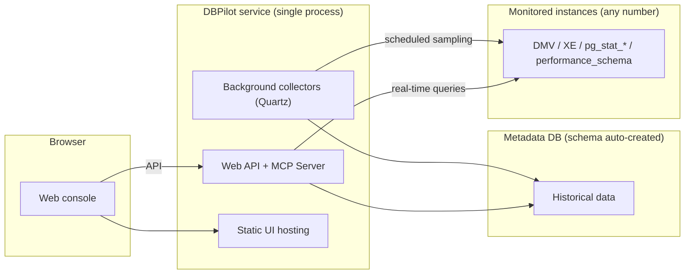

# DBPilot

**Self-hosted database autonomous diagnostics platform**.

[](https://www.nuget.org/packages/DBPilot)
[](https://www.nuget.org/packages/DBPilot)
[](LICENSE.txt)
[](https://dotnet.microsoft.com/download/dotnet/8.0)
[](#engine-support-matrix)

DBPilot continuously samples your instances and serves the day-to-day DBA workflow in one web console: performance trends and insight (AAS load decomposition), Top SQL, query plan change tracking, missing-index advice, index usage & fragmentation, blocking analysis, deadlock analysis, and slow query logs.

[简体中文](README.zh-CN.md)


## Contents

- [Highlights](#highlights)
- [Screenshots](#screenshots)
- [Quick start](#quick-start)
- [Password and master key](#password-and-master-key)
- [Configuration](#configuration-appsettingsjson)
- [Building from source](#building-from-source)
- [Architecture](#architecture)
- [Features](#features)
- [Engine support matrix](#engine-support-matrix)
- [AI diagnostics (MCP Server)](#ai-diagnostics-mcp-server)
- [Overhead on monitored instances](#overhead-on-monitored-instances)
- [Embedding via NuGet](#embedding-via-nuget)
- [FAQ](#faq)
- [License](#license)

## Highlights

- **Single-process deployment** — one .NET process (8.0+) + one metadata DB, schema auto-created on startup (SQL Server / MySQL / PostgreSQL / SQLite).
- **Monitors three engines** — SQL Server 2008–2022, MySQL 8.0+, PostgreSQL 13+. Monitoring and metadata-store engines are independent axes: any combination works.
- **<1% CPU overhead** — collectors read only in-memory metadata views (DMVs / `pg_stat_*` / `performance_schema`); business tables are never scanned.
- **AI-ready** — built-in read-only MCP Server exposes 11 diagnostic tools to AI agents (Claude Code, Codex CLI). Just ask: *"did any SQL slow down in the last hour?"*
- **Capability-driven UI** — features without an equivalent data source hide or degrade per engine (PostgreSQL gets deadlock *trends* instead of event details); APIs answer with actionable messages.

## Screenshots

| Performance insight (AAS) | Performance trends |
|---|---|
|  |  |

| Deadlock analysis | Deadlock event detail |
|---|---|
|  |  |

| Blocking analysis | Blocking chain detail |
|---|---|
|  |  |

| Index usage | Slow query log |
|---|---|
|  |  |

## Quick start

Fastest path: NuGet packages (frontend embedded — no Node.js). Requires .NET SDK 8.0+ — packages run on .NET 8 or later.

1. Create a host project and add the metapackage:

```bash
mkdir dbpilot-demo && cd dbpilot-demo
dotnet new web
dotnet add package DBPilot
```

> Don't name the host project `dbpilot` or `DBPilot.*` — it collides with the NuGet package and restore fails (NU1108).

2. Replace `Program.cs` with:

```csharp
using DBPilot.AspNetCore.Extension;
using DBPilot.Core.Providers;

var builder = WebApplication.CreateBuilder(args);
builder.AddDBPilot(o => o.PlatformEngine = DbpilotEngine.Sqlite);  // metadata store: SQLite, zero dependencies

var app = builder.Build();
app.UseDBPilot();
app.Run();
```

3. Replace `appsettings.json` with (SQLite flavor):

```json
{
  "Serilog": {
    "MinimumLevel": {
      "Default": "Information",
      "Override": { "Microsoft": "Warning", "System": "Warning" }
    }
  },
  "DBPilot": {
    "ConnectionString": "Data Source=dbpilot_platform.db",
    "Mcp": { "ApiKey": "<random key; non-empty enables MCP, empty = off>" },
    "Auth": {
      "Username": "admin",
      "PasswordHash": "pbkdf2$100000$IOaBWezPYRnzEbBWYwLxZA==$xBWm8jjDfanDmyRttfnZoG4MIk8lcF0UnDbpjJuWaEU=",
      "Secret": "<your master key (>= 32-char random string)>"
    }
  },
  "AllowedHosts": "*"
}
```

- `ConnectionString` and `Auth:Secret` are required — the SQLite file and schema are created on startup; the master key is generated as shown [below](#password-and-master-key).
- `PasswordHash` is the hash of the default password `dbpilot@2026`; keep it to log in with the default.

4. Run:

```bash
dotnet run    # → http://localhost:5000
```

5. Log in with `admin` / `dbpilot@2026` (**change it after deployment**), then register your first instance: **Instances → Add** → Test connection → Enable. Real-time pages work immediately; history accumulates.

**Metadata store**: for SQL Server / MySQL / PostgreSQL, switch `PlatformEngine` and the connection string — that's all; registered instances are unaffected. SQLite suits evaluation and single-machine use; prefer a server engine for production (and multi-process roles). Ready-made hosts: [`samples/`](samples/) (SqlServer :5200 / MySql :5201 / Sqlite :5203 / PostgreSql :5204).

## Password and master key

**Change the login password**: passwords are PBKDF2 hashes in `DBPilot:Auth:PasswordHash` — replace the hash to change the password.

1. Create a two-line `hash.cs` **outside any project directory** (your home dir works). Inside a project, `dotnet run` would treat it as an argument. File-based apps with `#:package` need .NET SDK 10; on SDK 8 use the repo-clone alternative below:

```csharp
#:package DBPilot.Core@0.5.4
Console.WriteLine(DBPilot.Core.Auth.PasswordHasher.Hash(args[0]));
```

2. Run it — the whole output line is the new hash:

```bash
dotnet run hash.cs <new-password>
```

3. Paste it into `DBPilot:Auth:PasswordHash`, restart.

Repo clones can skip the steps: `dotnet run --project samples/DBPilot.Sample.SqlServer -- --hash <new-password>`.

**Master key** (`Auth:Secret`, or env `DBPILOT_MASTER_KEY`) — required, exactly two uses:

| Purpose | What it does | If you change it |
|---|---|---|
| Login-cookie signing | issues/validates login tickets (HMAC-SHA256) | all sessions logged out; log in again |
| Instance-credential encryption | instance passwords stored AES-256-GCM-encrypted in the metadata DB | **old ciphertext is undecryptable, no recovery** — re-enter each instance's password in the UI |

Hence startup fails without it, and you should **not change it once in use**. Generate one:

```bash
openssl rand -base64 32      # Linux / macOS / Git Bash
# PowerShell: [guid]::NewGuid().ToString("N") + [guid]::NewGuid().ToString("N")
```

## Configuration (appsettings.json)

Two required keys + one required value — `DBPilot:ConnectionString`, `DBPilot:PlatformEngine`, and a master key (`Auth:Secret` or env `DBPILOT_MASTER_KEY`). Missing → startup error; everything else is optional with defaults.

| Key | Required | Notes |
|---|---|---|
| `DBPilot:ConnectionString` | **yes** | metadata DB connection string; schema auto-created on startup |
| `DBPilot:PlatformEngine` | **yes** | `sqlserver` / `mysql` / `postgresql` / `sqlite`; in code: `o.PlatformEngine = DbpilotEngine.SqlServer`. Independent of which engines you monitor |
| `DBPilot:Auth:Secret` | **yes** (or env) | master key — signs login cookies, encrypts instance credentials; ≥32-char random string |
| `DBPILOT_MASTER_KEY` (env) | **yes** (or Secret) | env form of the master key, container-friendly; config value takes precedence |
| `DBPilot:Auth:Username` / `PasswordHash` | no | login account (default `admin`) / password hash (default `dbpilot@2026`) |
| `DBPilot:Mcp:ApiKey` | no | MCP Server switch (non-empty = on) |
| `DBPilot:Roles` | no | process roles (Web / Collector, both by default); multi-process = 1 collector + N web fronts — two collectors on one metadata DB double-collect |
| `DBPilot:Jobs` | no | per-collector switch & cron; empty value = disable that collector |
| `DBPilot:Retention` / `DBPilot:Collect` | no | retention days (auto-clean) / parallelism & backoff |
| `DBPilot:AutoInitSchema` | no | auto-create schema on startup (default true; set false when DBAs own the schema) |
| `DBPilot:TopSqlExcludePatterns` | no | Top SQL noise filter (LIKE patterns); default set built in, explicit empty array clears it |

Monitored instances are never configured here — they live in the UI, credentials encrypted in the metadata DB.

## Building from source

Additionally requires **Node.js 20+** (the embedded web UI comes from the frontend build; NuGet packages ship it prebuilt).

```bash
git clone https://github.com/SkyChenSky/DBPilot.git
cd DBPilot
scripts\run\setup.bat      # frontend build + compile + sample appsettings.json (default SqlServer host; pass MySql / Sqlite / PostgreSql to switch)
# edit samples/DBPilot.Sample.SqlServer/appsettings.json — fill in the connection string and Auth:Secret
dotnet run --project samples/DBPilot.Sample.SqlServer    # → http://localhost:5200
```

Non-Windows / manual equivalent:

```bash
cd web && npm install && npm run build
cd .. && dotnet build
cp samples/DBPilot.Sample.SqlServer/appsettings.template.json samples/DBPilot.Sample.SqlServer/appsettings.json
```

Day-to-day dev: `scripts\run\dev.bat`, or two terminals — `dotnet watch --project samples/DBPilot.Sample.SqlServer` (backend, Swagger at `/swagger`) + `cd web && npm run dev` (frontend → http://localhost:5173). Tests: `scripts\run\test.bat` (compile + unit tests + frontend build). Self-test load scripts in `scripts/test/` — never run them against production databases.

## Architecture



The browser talks only to the DBPilot service: real-time pages query instances directly, history pages read the metadata DB — both share the same data conventions (noise exclusion, fingerprinting, time windows).

## Features

| Page | What it answers |
|---|---|
| **Overview** | instance health at a glance — metric cards with sparklines, recent events, Top SQL digest |
| **Performance trends** | CPU / memory / PLE / QPS·TPS / IO / disk, 10s granularity (30-day retention, auto down-sampling); event overlay for deadlocks / slow SQL / plan changes |
| **Performance insight** | Average Active Sessions decomposed into CPU / lock / IO / waits — which resource is saturated, and the SQL statements contributing the load |
| **Top SQL** | real-time leaderboard + history trends, merged by fingerprint; one-click noise exclusion |
| **Query plans** | plan versions snapshotted automatically; changes raise events with before/after comparison, plan tree and XML |
| **Missing indexes** | optimizer recommendations ranked by impact, with CREATE scripts and overlap hints |
| **Index usage / fragmentation** | unused-index detection with drop scripts; fragmentation scan with REBUILD / REORGANIZE scripts |
| **Blocking analysis** | real-time blocking tree (head blocker, chain, wait times) + historical statistics |
| **Deadlock analysis** | captured automatically; graph view of the cycle, statements and lock relationships |
| **Slow query log** | above-threshold statements archived automatically — full text, duration, IO, fingerprint |

## Engine support matrix

| Capability | SQL Server | MySQL 8.0+ | PostgreSQL 13+ |
|---|---|---|---|
| Sessions / blocking (real-time tree + history) | ✅ | ✅ | ✅ (`pg_stat_activity` + `pg_blocking_pids`) |
| Top SQL (fingerprinted) | ✅ | ✅ (`performance_schema` digest) | ✅ (`pg_stat_statements`) |
| Slow query log | ✅ (XE events) | ✅ (`mysql.slow_log` table) | ◐ template leaderboard |
| Performance trends | ✅ | ◐ (no OS CPU/memory, PLE, compile counters) | ◐ (QPS is transaction-scope) |
| Deadlock analysis | ✅ event details + graph | ❌ | ◐ trend only |
| Query plan snapshots / change tracking | ✅ | ❌ | ❌ |
| Missing index advice | ✅ | ❌ | ❌ |
| Index usage | ✅ | ◐ (unused-index detection conservative) | ◐ (unused indexes reliably detectable) |
| Fragmentation scan | ✅ | ❌ | ❌ |
| Index disable script | ✅ | ✅ (`INVISIBLE`) | ❌ |
| Disk usage | ✅ volume-level | ◐ database-level | ◐ database-level |

**Metadata store**: SQL Server / MySQL / PostgreSQL / SQLite — independent from the monitored engines, any combination (SQLite = single-executable + single-file embedded deployment).

Prerequisites are minimal and self-checked by the connection-test wizard: MySQL needs `performance_schema` + slow-log settings; PostgreSQL needs the `pg_stat_statements` extension; SQL Server works from 2008 up (deadlock capture rides the built-in `system_health` session). The wizard tells you exactly what to change when something is missing.

## AI diagnostics (MCP Server)

A read-only MCP Server (`/mcp`, Streamable HTTP + API key) hands the platform's evidence — metrics, slow SQL, deadlocks, blocking, indexes — to AI agents as 11 read-only tools. Agents never connect to your databases directly; every call is audit-logged.

Enable (off by default; non-empty `ApiKey` = on):

```json
"DBPilot": { "Mcp": { "ApiKey": "a sufficiently random key" } }
```

```bash
claude mcp add --transport http dbpilot http://localhost:5200/mcp --header "X-Api-Key: <your-key>"
```

Then just ask: *"use dbpilot to check the instance load over the last hour — any SQL getting slower?"* Add `--scope user` to make it global.

**Codex CLI** (`~/.codex/config.toml`):

```toml
[mcp_servers.dbpilot]
url = "http://localhost:5200/mcp"

[mcp_servers.dbpilot.http_headers]
X-Api-Key = "<your-key>"
```

Example projects live in [`examples/`](examples/): `DBPilot.McpConsole` (command-line diagnostic console) and `DBPilot.Scenarios` (fault-drill project), both referencing the official NuGet packages.

## Overhead on monitored instances

**<1% CPU, zero disk pressure.** Collectors read in-memory metadata views only — no business-table scans, no physical IO, no locks on user objects.

| Collector | Frequency | Cost |
|---|---|---|
| Sessions / metrics / Top SQL delta / deadlocks / slow SQL | 10–60s | millisecond-level metadata queries; XE cursors near zero when idle |
| Query plan snapshots | 5 min | plan XML fetched once per fingerprint (XML generation is the expensive part) |
| Index snapshots (incl. fragmentation) | daily 03:10 | heaviest tick, scheduled at night |
| History writes | — | always to the metadata DB, never to monitored instances |

Built-in mitigations: XE predicates exclude the platform's own traffic, every cron is configurable, instances disable individually, failed connections back off. Same DMV-polling path as SQL Server's own `system_health` and AWS Performance Insights.

Verify it yourself — after a day of running, the monitoring account's accumulated CPU seconds is the true cost:

```sql
SELECT login_name, SUM(cpu_time)/1000 AS cpu_seconds_total
FROM sys.dm_exec_sessions
WHERE host_process_id IS NOT NULL
GROUP BY login_name;
```

## Embedding via NuGet

Published on [nuget.org](https://www.nuget.org/packages?q=DBPilot):

```bash
dotnet add package DBPilot            # metapackage: AspNetCore + all engines, one line
# or pick what you need:
dotnet add package DBPilot.AspNetCore # API / MCP / auth / scheduling / embedded frontend
dotnet add package DBPilot.SqlServer  # engines — SqlServer / MySql / PostgreSql (monitor + storage)
dotnet add package DBPilot.MySql      #   and Sqlite (storage only, embedded deployments)
dotnet add package DBPilot.Sqlite
```

```csharp
using DBPilot.AspNetCore.Extension;
using DBPilot.Core.Providers;

var builder = WebApplication.CreateBuilder(args);
builder.AddDBPilot(o =>
{
    o.PlatformEngine = DbpilotEngine.SqlServer;  // no default — set explicitly (or via DBPilot:PlatformEngine)
    // o.WebOnly();                               // delegate sets only what you want to change
});

var app = builder.Build();
app.UseDBPilot();
app.Run();
```

- **Zero wiring** — referenced engine packages register themselves (output-directory scan); instances route by their `engine` column. Explicit registration (`AddDbpilotSqlServer()`) mixes in and is required for single-file publishes.
- Package graph: `DBPilot.AspNetCore → Core → Storage → Common`; engine packages depend on Core + Storage.
- Frontend assets ship twice — `buildTransitive` targets copy into `wwwroot`, plus an embedded-manifest fallback so the UI works even with an empty wwwroot.
- Fine-grained methods (`AddDbpilotWeb` / `AddDbpilotMcp` / `AddDbpilotQuartz` / ...) remain available.

## FAQ

| Symptom | Fix |
|---|---|
| Startup warning `平台库结构初始化失败` (schema init failed) | check `DBPilot:ConnectionString` and DB reachability; ignorable without persistence |
| Home page 404 / stale UI | frontend not built — `cd web && npm install && npm run build`, rebuild, restart |
| Startup error "DBPilot 主密钥未配置" (master key missing) | set `DBPilot:Auth:Secret` or env `DBPILOT_MASTER_KEY` |
| Collector error `The computed authentication tag did not match...` | master key doesn't match the stored credential ciphertext (changed after instances were registered) — re-enter each instance's password in the UI |
| Performance insight empty | instance enabled and collecting? Insights need ~1 minute of samples |
| Deadlock / slow SQL events not showing yet | event files buffer ~1 minute — wait and refresh |

## License

[Apache-2.0](LICENSE.txt)
