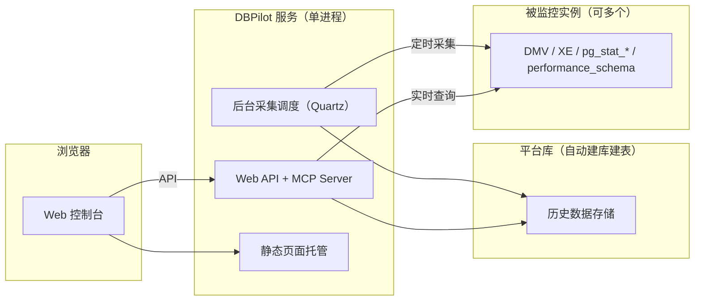

# DBPilot 数据库自治诊断平台

**自托管的数据库自治诊断系统**。

[English](README.md)

[](https://www.nuget.org/packages/DBPilot)
[](LICENSE.txt)
[](https://dotnet.microsoft.com/download/dotnet/8.0)
[](#引擎支持矩阵)

DBPilot 持续采集实例性能数据，在一个 Web 控制台里完成日常 DBA 工作：性能趋势与性能洞察（AAS 负载拆解）、Top SQL、执行计划变更跟踪、缺失索引建议、索引使用与碎片、阻塞分析、死锁分析、慢日志。


## 目录

- [亮点](#亮点)
- [截图](#截图)
- [快速开始](#快速开始)
- [登录密码与主密钥](#登录密码与主密钥)
- [配置（appsettings.json）](#配置appsettingsjson)
- [源码调试](#源码调试)
- [架构](#架构)
- [功能一览](#功能一览)
- [引擎支持矩阵](#引擎支持矩阵)
- [AI 诊断（MCP Server）](#ai-诊断mcp-server)
- [对被监控实例的性能影响](#对被监控实例的性能影响)
- [库引用接入（NuGet）](#库引用接入nuget)
- [常见问题](#常见问题)
- [许可](#许可)

## 亮点

- **单进程部署**：一个 .NET 进程（8.0+）+ 一个平台库，启动自动建库建表（SQL Server / MySQL / PostgreSQL / SQLite）
- **三引擎监控**：SQL Server 2008~2022、MySQL 8.0+、PostgreSQL 13+。平台库引擎与被监控引擎两轴独立，任意组合
- **<1% CPU 开销**：只读内存元数据视图（DMV / `pg_stat_*` / `performance_schema`），不扫业务表
- **AI 就绪**：内置只读 MCP Server，11 个诊断工具交给 AI agent（Claude Code / Codex CLI），直接问"这个实例最近一小时有没有变慢的 SQL？"
- **能力矩阵驱动 UI**：某引擎无对等数据源的功能自动隐藏或降级（如 PostgreSQL 死锁页展示趋势而非事件明细），API 返回可操作的指引文案

## 截图

| 性能洞察（AAS） | 性能趋势 |
|---|---|
|  |  |

| 死锁分析 | 死锁事件详情 |
|---|---|
|  |  |

| 阻塞分析 | 阻塞链详情 |
|---|---|
|  |  |

| 索引使用率 | 慢查询日志 |
|---|---|
|  |  |

## 快速开始

最快路径是 NuGet 包（前端已内嵌，无需 Node.js）。依赖 .NET SDK 8.0+——包面向 .NET 8 及以上运行时。

1. 创建宿主工程并安装元包：

```bash
mkdir dbpilot-demo && cd dbpilot-demo
dotnet new web
dotnet add package DBPilot
```

> 宿主工程不要取名 `dbpilot`（或任何 `DBPilot.*`）——与 NuGet 包同名会导致还原失败（NU1108）。

2. `Program.cs` 整份替换为：

```csharp
using DBPilot.AspNetCore.Extension;
using DBPilot.Core.Providers;

var builder = WebApplication.CreateBuilder(args);
builder.AddDBPilot(o => o.PlatformEngine = DbpilotEngine.Sqlite);  // 平台库：SQLite 单文件零依赖

var app = builder.Build();
app.UseDBPilot();
app.Run();
```

3. `appsettings.json` 整份替换为（SQLite 形态）：

```json
{
  "Serilog": {
    "MinimumLevel": {
      "Default": "Information",
      "Override": { "Microsoft": "Warning", "System": "Warning" }
    }
  },
  "DBPilot": {
    "ConnectionString": "Data Source=dbpilot_platform.db",
    "Mcp": { "ApiKey": "<随机 key，非空即开启 MCP，留空 = 关>" },
    "Auth": {
      "Username": "admin",
      "PasswordHash": "pbkdf2$100000$IOaBWezPYRnzEbBWYwLxZA==$xBWm8jjDfanDmyRttfnZoG4MIk8lcF0UnDbpjJuWaEU=",
      "Secret": "<你的主密钥（≥32 字符随机串）>"
    }
  },
  "AllowedHosts": "*"
}
```

- `ConnectionString` 与 `Auth:Secret` 必填——SQLite 库文件与表结构启动自动创建；主密钥生成方法见[下文](#登录密码与主密钥)
- `PasswordHash` 是默认密码 `dbpilot@2026` 的哈希，不动即用默认密码登录

4. 启动：

```bash
dotnet run    # → http://localhost:5000
```

5. 用 `admin` / `dbpilot@2026` 登录（**部署后先改密码**），接入第一个实例：**实例管理 → 新增** → 连接测试 → 启用。实时页面立即可用，历史数据随运行积累。

**平台库**：换 SQL Server / MySQL / PostgreSQL 只改 `PlatformEngine` 与连接串两处，已接入实例不受影响。SQLite 适合试用与单机；长期/生产（及多进程 Roles）建议服务端引擎。现成宿主在 [`samples/`](samples/)（SqlServer :5200 / MySql :5201 / Sqlite :5203 / PostgreSql :5204）。

## 登录密码与主密钥

**修改登录密码**：密码以 PBKDF2 哈希存于 `DBPilot:Auth:PasswordHash`——换密码就是换这个哈希。

1. 在**没有工程文件的目录**（如用户主目录）新建 `hash.cs`。放在工程目录里会被 `dotnet run` 当成参数传给工程。`#:package` 文件式应用需 .NET 10 SDK，SDK 8 用户可改用下方仓库克隆方式：

```csharp
#:package DBPilot.Core@0.5.4
Console.WriteLine(DBPilot.Core.Auth.PasswordHasher.Hash(args[0]));
```

2. 在该目录执行，输出整行即新密码的哈希：

```bash
dotnet run hash.cs <新密码>
```

3. 填入 `DBPilot:Auth:PasswordHash`，重启生效。

已克隆仓库可跳过：`dotnet run --project samples/DBPilot.Sample.SqlServer -- --hash <新密码>`。

**主密钥**（`Auth:Secret` / 环境变量 `DBPILOT_MASTER_KEY`，二选一必填），全程序两个用途：

| 用途 | 做什么 | 换主密钥的后果 |
|---|---|---|
| 登录 Cookie 签名 | HMAC-SHA256 签发/校验登录票据 | 已登录会话全部失效，重新登录即恢复 |
| 实例凭据加密 | 实例密码以 AES-256-GCM 密文存平台库 | **旧密文不可再解、无恢复手段**——需在实例管理重新录入各实例密码 |

因此缺失启动即报错，且**一经使用请勿更换**。生成随手一个：

```bash
openssl rand -base64 32      # Linux / macOS / Git Bash
# PowerShell：[guid]::NewGuid().ToString("N") + [guid]::NewGuid().ToString("N")
```

## 配置（appsettings.json）

必填两键一值：`DBPilot:ConnectionString` + `DBPilot:PlatformEngine` + 主密钥（`Auth:Secret` 或环境变量），缺失启动即报错；其余全部选填、有默认值。

| 配置 | 档 | 说明 |
|---|---|---|
| `DBPilot:ConnectionString` | **必填** | 平台库连接串；表结构启动自动创建 |
| `DBPilot:PlatformEngine` | **必填** | `sqlserver` / `mysql` / `postgresql` / `sqlite`；代码写 `o.PlatformEngine = DbpilotEngine.SqlServer`。与被监控引擎无关 |
| `DBPilot:Auth:Secret` | **必填**（或环境变量） | 主密钥：Cookie 签名 + 凭据加密；≥32 字符随机串 |
| `DBPILOT_MASTER_KEY`（环境变量） | **必填**（或 Secret） | 主密钥的环境变量形态，容器部署友好；配置值优先 |
| `DBPilot:Auth:Username` / `PasswordHash` | 选填 | 登录账号（默认 `admin`）/ 密码哈希（默认密码 `dbpilot@2026`） |
| `DBPilot:Mcp:ApiKey` | 选填 | MCP Server 开关（非空即开） |
| `DBPilot:Roles` | 选填 | 进程角色（Web / Collector，默认双开）；多进程 = 1 采集器 + N 个 Web，两个 Collector 连同一平台库会双采 |
| `DBPilot:Jobs` | 选填 | 各采集任务开关与 cron；显式空值 = 禁用该任务 |
| `DBPilot:Retention` / `DBPilot:Collect` | 选填 | 历史保留天数（到期自动清理）/ 并行度与退避 |
| `DBPilot:AutoInitSchema` | 选填 | 启动自动初始化平台库结构（默认 true；表结构归 DBA 管理时置 false） |
| `DBPilot:TopSqlExcludePatterns` | 选填 | Top SQL 噪音过滤（LIKE 模式数组）；缺省用内置默认集，显式空数组 = 清空 |

被监控实例不在这里配置——在页面"实例管理"维护，凭据加密存于平台库。

## 源码调试

额外需要 **Node.js 20+**（内嵌 Web UI 由前端构建产出；NuGet 包里带的是构建好的前端）。

```bash
git clone https://github.com/SkyChenSky/DBPilot.git
cd DBPilot
scripts\run\setup.bat      # 一键：前端构建 + 编译 + 生成 sample 的 appsettings.json（默认 SqlServer 宿主，换宿主传参 MySql / Sqlite / PostgreSql）
# 编辑 samples/DBPilot.Sample.SqlServer/appsettings.json，填入连接串与 Auth:Secret
dotnet run --project samples/DBPilot.Sample.SqlServer    # → http://localhost:5200
```

非 Windows / 手动等价：

```bash
cd web && npm install && npm run build
cd .. && dotnet build
cp samples/DBPilot.Sample.SqlServer/appsettings.template.json samples/DBPilot.Sample.SqlServer/appsettings.json
```

日常开发：`scripts\run\dev.bat`，或开两个终端——`dotnet watch --project samples/DBPilot.Sample.SqlServer`（后端，Swagger 在 `/swagger`）+ `cd web && npm run dev`（前端 → http://localhost:5173）。测试：`scripts\run\test.bat`（编译 + 单测 + 前端构建一次跑完）；自测负载脚本在 `scripts/test/`——**不要在真实/生产库执行**。

## 架构



浏览器只和 DBPilot 服务打交道：实时页直查实例，历史页读平台库，两路共用同一套数据口径（噪音排除、指纹、时间窗）。

## 功能一览

| 页面 | 解决的问题 |
|---|---|
| **实例概览** | 实例健康一屏览：指标卡（迷你趋势/峰值/均值）、近期事件、TopSQL 摘要 |
| **性能趋势** | CPU / 内存 / PLE / QPS·TPS / IO / 磁盘，10 秒粒度（保留 30 天，长区间自动降采样）；可叠加事件竖线（死锁/慢SQL/计划变更） |
| **性能洞察** | 平均活跃会话（AAS）拆解 CPU / 锁 / IO / 等待——哪类资源打满、哪些 SQL 贡献的负载 |
| **Top SQL** | 实时榜 + 历史趋势，相同指纹自动合并；噪音一键排除 |
| **执行计划** | 计划版本自动快照，变化生成事件，对比前后资源消耗、计划树与 XML |
| **缺失索引** | 优化器推荐按影响排序，附建索引脚本与重叠提示 |
| **索引使用 / 碎片** | 无用索引识别（附删除脚本）；碎片扫描给 REBUILD / REORGANIZE 脚本 |
| **阻塞分析** | 实时阻塞树（头阻塞者、链路、等待时长）+ 历史统计 |
| **死锁分析** | 自动捕获，图形化展示环路与各方语句、持锁/等待关系 |
| **慢日志** | 超阈值 SQL 自动留档：完整文本、耗时、IO、指纹 |

### 按问题找页面

| 你遇到的现象 | 去哪里看 |
|---|---|
| 想看实例整体水位 | 实例概览 / 性能趋势 |
| 整体变慢、资源打满 | 性能洞察 → 下钻 Load By SQL |
| 找耗资源大户 | Top SQL |
| 某条 SQL 突然变慢 | Top SQL → 该 SQL 的计划与变更记录 |
| 表扫描多、写入慢 | 缺失索引 |
| 磁盘紧张、索引维护 | 索引使用 / 碎片 |
| 页面卡住、互相等 | 阻塞分析（实时树）→ 反复失败报死锁则看死锁分析 |
| 排查历史慢查询 | 慢日志 |

### 使用步骤

1. **接入实例**：实例管理 → 新增 → 连接测试（缺权限会给提示与修复脚本）→ 启用
2. **采集自动运行**：实时页面立即可用，性能洞察约 1 分钟出数据；历史数据随运行积累

## 引擎支持矩阵

| 能力 | SQL Server | MySQL 8.0+ | PostgreSQL 13+ |
|---|---|---|---|
| 会话 / 阻塞（实时树 + 历史留痕） | ✅ | ✅ | ✅（`pg_stat_activity` + `pg_blocking_pids`） |
| Top SQL（指纹合并） | ✅ | ✅（`performance_schema` digest） | ✅（`pg_stat_statements`） |
| 慢日志 | ✅（XE 事件） | ✅（`mysql.slow_log` 表） | ◐ 模板榜 |
| 性能趋势 | ✅ | ◐（无 OS 级 CPU/内存、PLE、编译计数） | ◐（QPS 为事务域口径） |
| 死锁分析 | ✅ 事件明细 + 图形 | ❌ | ◐ 趋势-only |
| 执行计划（快照/变更/XML） | ✅ | ❌ | ❌ |
| 缺失索引建议 | ✅ | ❌ | ❌ |
| 索引使用率 | ✅ | ◐（无用索引判定偏保守） | ◐（无用索引可真实判定） |
| 碎片扫描 | ✅ | ❌ | ❌ |
| 索引禁用脚本 | ✅ | ✅（INVISIBLE） | ❌ |
| 磁盘用量 | ✅ 卷级 | ◐ 库级容量 | ◐ 库级容量 |

**平台库引擎**：SQL Server / MySQL / PostgreSQL / SQLite——与被监控引擎独立组合（SQLite 即"单 exe + 单 .db 文件"嵌入式部署，不能作为被监控实例接入，不支持多进程 Roles 形态）。

前置条件很少且由连接测试向导逐项自检：MySQL 需 `performance_schema` + 慢日志开关；PostgreSQL 需 `pg_stat_statements` 扩展；SQL Server 2008 起全覆盖（死锁捕获走内置 `system_health` 会话）。缺什么向导直接告诉你改什么。

## AI 诊断（MCP Server）

内置只读 MCP Server（`/mcp`，Streamable HTTP + API Key），把指标/慢SQL/死锁/阻塞/索引证据以 11 个只读工具交给 AI agent。Agent 全程不直连你的数据库，每次调用记审计日志。

**开启**（默认关；`ApiKey` 非空即开）：

```json
"DBPilot": { "Mcp": { "ApiKey": "换成一个足够随机的 key" } }
```

**接入 Claude Code**：

```bash
claude mcp add --transport http dbpilot http://localhost:5200/mcp --header "X-Api-Key: <你的key>"
```

验证（`claude mcp list` 或会话内 `/mcp`）后直接提问："用 dbpilot 查一下实例最近一小时的负载，有没有变慢的 SQL？"加 `--scope user` 全局可用。

**Codex CLI**（`~/.codex/config.toml`）：

```toml
[mcp_servers.dbpilot]
url = "http://localhost:5200/mcp"

[mcp_servers.dbpilot.http_headers]
X-Api-Key = "<你的key>"
```

示例工程在 [`examples/`](examples/)：`DBPilot.McpConsole`（命令行诊断对话台）与 `DBPilot.Scenarios`（故障演练工程），均引用官方 NuGet 包。

## 对被监控实例的性能影响

**常规运行 <1% CPU、零磁盘压力。** 采集只读内存元数据视图——不扫业务表、不产生物理 IO、不对用户对象加锁。

| 采集 | 颻率 | 开销 |
|---|---|---|
| 会话采样 / 指标 / TopSQL 差值 / 死锁 / 慢SQL | 10~60s | 毫秒级元数据查询；XE 游标平时近零 |
| 执行计划快照 | 5min | 计划 XML 每指纹只抓一份（XML 生成才是贵操作） |
| 索引快照（含碎片扫描） | 每日 03:10 | 全天最重一拍，排在凌晨 |
| 历史数据写入 | — | 全部写平台库，不碰被监控实例 |

内置减负：XE 谓词排除平台自身流量、cron 全部可调、实例可单独停用、连接失败自动退避。与 SQL Server 自带 `system_health`、AWS Performance Insights 同一条 DMV 轮询路径。

可自证：跑一天后监控账号的累计 CPU 秒即真实开销——

```sql
SELECT login_name, SUM(cpu_time)/1000 AS cpu_seconds_total
FROM sys.dm_exec_sessions
WHERE host_process_id IS NOT NULL
GROUP BY login_name;
```

## 库引用接入（NuGet）

已发布 [nuget.org](https://www.nuget.org/packages?q=DBPilot)：

```bash
dotnet add package DBPilot            # 元包：AspNetCore + 全部引擎包，一行装齐
# 或按需选装：
dotnet add package DBPilot.AspNetCore # 主包：API / MCP / 认证 / 调度 / 内嵌前端
dotnet add package DBPilot.SqlServer  # 引擎包：SqlServer / MySql / PostgreSql（监控 + 存储）
dotnet add package DBPilot.MySql      #   及 Sqlite（仅存储，嵌入式部署）
dotnet add package DBPilot.Sqlite
```

```csharp
using DBPilot.AspNetCore.Extension;
using DBPilot.Core.Providers;

var builder = WebApplication.CreateBuilder(args);
builder.AddDBPilot(o =>
{
    o.PlatformEngine = DbpilotEngine.SqlServer;  // 无默认值，必须显式指定（或写 DBPilot:PlatformEngine 配置）
    // o.WebOnly();                               // 默认全开；委托只写要改的
});

var app = builder.Build();
app.UseDBPilot();
app.Run();
```

- **引擎零接入**：引擎包被引用后自动注册（扫描输出目录），实例按 engine 列路由；显式注册 `AddDbpilotSqlServer()` 等可混用，单文件发布须改显式注册
- 包结构：`DBPilot.AspNetCore → Core → Storage → Common`；引擎包依赖 Core + Storage，可独立选装
- 前端资产双通道：`buildTransitive` targets 落到 `wwwroot`，另有 DLL 内嵌清单兜底——wwwroot 为空页面也能出
- 细粒度方法（`AddDbpilotWeb` / `AddDbpilotMcp` / `AddDbpilotQuartz` / ...）仍可用

## 常见问题

| 现象 | 处理 |
|---|---|
| 启动告警 `平台库结构初始化失败` | 检查 `DBPilot:ConnectionString` 与数据库可达性；暂不接库可忽略 |
| 打开首页 404 / 旧版本页面 | 前端未构建：`cd web && npm install && npm run build` 后重新 build 再重启 |
| 启动报错「DBPilot 主密钥未配置」 | 设置 `DBPilot:Auth:Secret` 或环境变量 `DBPILOT_MASTER_KEY`（二选一） |
| 采集报错 `The computed authentication tag did not match...` | 主密钥与凭据密文不匹配（录入实例后换过 `Auth:Secret`）——在实例管理重新录入各实例密码 |
| 性能洞察无数据 | 实例已启用且采集正常？采样满 1 分钟后生成 |
| 死锁/慢SQL 事件看不到 | 事件落盘有约 1 分钟缓冲，稍等后刷新 |

## 许可

[Apache-2.0](LICENSE.txt)
