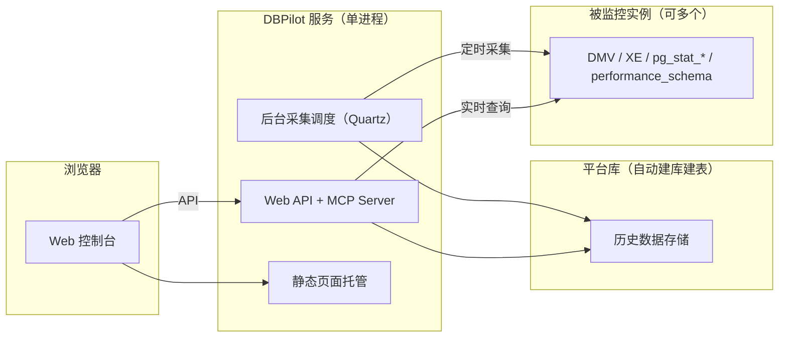

# DBPilot 数据库自治诊断平台

**自托管的数据库自治诊断系统**。

[English](README.md)

[](https://www.nuget.org/packages/DBPilot)
[](LICENSE.txt)
[](https://dotnet.microsoft.com/download/dotnet/10.0)
[](#引擎支持矩阵)

DBPilot 持续采集数据库实例的性能数据，在一个 Web 控制台里完成日常 DBA 工作：性能趋势、性能洞察（AAS 负载拆解）、Top SQL、执行计划变更跟踪、缺失索引建议、索引使用与碎片、阻塞分析、死锁分析、慢日志。


## 目录

- [亮点](#亮点)
- [截图](#截图)
- [快速开始](#快速开始)
- [登录密码与主密钥](#登录密码与主密钥)
- [源码调试](#源码调试)
- [架构](#架构)
- [功能一览](#功能一览)
- [引擎支持矩阵](#引擎支持矩阵)
- [AI 诊断（MCP Server）](#ai-诊断mcp-server)
- [对被监控实例的性能影响](#对被监控实例的性能影响)
- [配置（appsettings.json）](#配置appsettingsjson)
- [库引用接入（NuGet）](#库引用接入nuget)
- [常见问题](#常见问题)
- [许可](#许可)

## 亮点

- **单进程部署**：一个 .NET 10 进程 + 一个平台库（启动自动建库建表），平台库可选 SQL Server / MySQL / PostgreSQL / SQLite
- **三引擎监控**：SQL Server 2008~2022、MySQL 8.0+、PostgreSQL 13+。平台库引擎与被监控引擎**两轴独立、任意组合**（如平台库用 PostgreSQL、监控 SQL Server）
- **采集开销极低**：常规运行 <1% CPU。只读内存元数据视图（DMV / `pg_stat_*` / `performance_schema`），不扫业务表，详见[对被监控实例的性能影响](#对被监控实例的性能影响)
- **AI 就绪**：内置只读 MCP Server，11 个只读工具交给 AI agent（Claude Code / Codex CLI），直接问"这个实例最近一小时有没有变慢的 SQL？"
- **能力矩阵驱动 UI**：某引擎无对等数据源的功能自动隐藏或降级（如 PostgreSQL 死锁页展示趋势而非事件明细），API 返回明确的指引文案

## 截图

| 性能洞察（AAS） | 性能趋势 |
|---|---|
|  |  |

| 死锁分析 | 死锁事件详情 |
|---|---|
|  |  |

| 阻塞分析 | 阻塞链详情 |
|---|---|
|  |  |

| 索引使用率 | 慢查询日志 |
|---|---|
|  |  |

## 快速开始

最快路径是 NuGet 包（前端资产已内嵌，无需 Node.js）。依赖：.NET SDK 10.0+。五步：

1. 创建宿主工程并安装元包（AspNetCore + 四个引擎包，一行装齐）：

```bash
mkdir dbpilot-demo && cd dbpilot-demo
dotnet new web
dotnet add package DBPilot
```

> 宿主工程不要取名 `dbpilot`（或任何 `DBPilot.*`）——与 NuGet 包同名会导致还原失败（NU1108 检测到循环）。

2. `Program.cs` 整份替换为：

```csharp
using DBPilot.AspNetCore.Extension;
using DBPilot.Core.Providers;

var builder = WebApplication.CreateBuilder(args);
builder.AddDBPilot(o => o.PlatformEngine = DbpilotEngine.Sqlite);  // 平台库引擎：SQLite 单文件零依赖，开箱即用

var app = builder.Build();
app.UseDBPilot();
app.Run();
```

3. `appsettings.json` 整份替换为（SQLite 形态，`Secret` 占位处换成自己的值）：

```json
{
  "Serilog": {
    "MinimumLevel": {
      "Default": "Information",
      "Override": { "Microsoft": "Warning", "System": "Warning" }
    }
  },
  "DBPilot": {
    "ConnectionString": "Data Source=dbpilot_platform.db",
    "Mcp": { "ApiKey": "<随机 key，非空即开启 MCP，留空 = 关>" },
    "Auth": {
      "Username": "admin",
      "PasswordHash": "pbkdf2$100000$IOaBWezPYRnzEbBWYwLxZA==$xBWm8jjDfanDmyRttfnZoG4MIk8lcF0UnDbpjJuWaEU=",
      "Secret": "<你的主密钥（≥32 字符随机串）>"
    }
  },
  "AllowedHosts": "*"
}
```

几处说明：`ConnectionString` 与 `Auth:Secret` 两条必填（连接串指向 SQLite 库文件、启动自动建库建表；主密钥用于登录 Cookie 签名与实例凭据加密，缺失启动即报错，生成方法见[登录密码与主密钥](#登录密码与主密钥)）；`PasswordHash` 这一串就是默认密码 `dbpilot@2026` 的哈希，不动即用默认密码登录；`Mcp:ApiKey` 留空 = MCP 关。

4. 启动：

```bash
dotnet run    # → http://localhost:5000
```

5. 浏览器打开，用默认账号 `admin` / `dbpilot@2026` 登录（**部署后先改密码**，见[登录密码与主密钥](#登录密码与主密钥)），然后接入第一个被监控实例：**实例管理 → 新增**（地址 + 账号密码，凭据加密存储）→ 连接测试 → 启用。实时页面立即可用，历史数据随运行积累。

### 平台库换 SQL Server

平台库换引擎只改两处（`PlatformEngine` 与连接串，其余配置不变；MySQL / PostgreSQL 同理，换 `DbpilotEngine.MySql` / `DbpilotEngine.PostgreSql`）：

```csharp
builder.AddDBPilot(o => o.PlatformEngine = DbpilotEngine.SqlServer);
```

```json
"ConnectionString": "Server=<你的地址>,1433;Initial Catalog=dbpilot;User Id=<账号>;Password=<密码>;Max Pool Size=20;Encrypt=False;TrustServerCertificate=True"
```

连接串指向一个空库即可（库已存在或账号有建库权限），表结构启动时自动创建。

> 平台库用 SQLite 只为开箱零依赖，适合试用与单机轻量部署（不支持多进程 Roles 形态）。长期/生产建议换 SQL Server / MySQL / PostgreSQL——届时只改 `PlatformEngine` 与连接串，平台库引擎与被监控引擎是两个独立轴，已接入的被监控实例不受影响。
> 上面这套接入的现成宿主在 [`samples/`](samples/)（SqlServer :5200 / MySql :5201 / Sqlite :5203 / PostgreSql :5204 四变体），从源码构建与调试见[源码调试](#源码调试)。

## 登录密码与主密钥

**修改登录密码**：密码以 PBKDF2 哈希（`pbkdf2$iterations$salt$hash`）存于 `DBPilot:Auth:PasswordHash`——改密码就是换掉这个哈希值，三步：

1. 在一个**没有工程文件的目录**（如用户主目录、临时目录）新建 `hash.cs`，内容两行。**不能放在 dbpilot-demo 这类工程目录里**——那里 `dotnet run` 跑的是工程，`hash.cs` 会被当成参数传给工程：

```csharp
#:package DBPilot.Core@0.5.2
Console.WriteLine(DBPilot.Core.Auth.PasswordHasher.Hash(args[0]));
```

2. 在该目录执行，输出的整行就是新密码的哈希：

```bash
dotnet run hash.cs <新密码>
```

3. 把输出整行填入 `appsettings.json` 的 `DBPilot:Auth:PasswordHash`（替换原来的那一串），重启服务生效。

已克隆仓库的可跳过上面三步：`dotnet run --project samples/DBPilot.Sample.SqlServer -- --hash <新密码>`（四个 Sample 任一均可）。

**主密钥（`Auth:Secret` / 环境变量 `DBPILOT_MASTER_KEY`，二选一必填）**：登录 Cookie 签名 + 实例凭据 AES-GCM 加密共用，缺失启动即报错（防重启后已录入实例的密码无法解密）。生成随手一个：

```bash
openssl rand -base64 32                                    # Linux / macOS / Git Bash
# PowerShell：[guid]::NewGuid().ToString("N") + [guid]::NewGuid().ToString("N")
```

## 源码调试

从源码构建跑起来。相比 NuGet 接入，额外需要 **Node.js 20+**（内嵌 Web UI 由前端构建产出，产物不进 git；NuGet 包里带的是已构建好的前端）。三步：

1. 克隆仓库并一键构建（前端构建 + 编译 + 生成 sample 的 appsettings.json；默认 SqlServer 宿主，换宿主传参 `setup.bat MySql` / `Sqlite` / `PostgreSql`）：

```bash
git clone https://github.com/SkyChenSky/DBPilot.git
cd DBPilot
scripts\run\setup.bat
```

2. 编辑 `samples/DBPilot.Sample.SqlServer/appsettings.json`，填入连接串与 `Auth:Secret`。

3. 启动：

```bash
dotnet run --project samples/DBPilot.Sample.SqlServer    # → http://localhost:5200
```

前端构建克隆后跑一次即可，之后仅前端有改动才需要重跑。非 Windows 或想手动执行时，第 1 步等价于：

```bash
cd web && npm install && npm run build
cd .. && dotnet build
cp samples/DBPilot.Sample.SqlServer/appsettings.template.json samples/DBPilot.Sample.SqlServer/appsettings.json
```

日常开发（改后端热重载 + 前端 dev server）：

```bash
scripts\run\dev.bat      # 或开两个终端：
dotnet watch --project samples/DBPilot.Sample.SqlServer   # 后端（Swagger: /swagger）
cd web && npm run dev                                     # 前端 → http://localhost:5173
```

- `scripts\run\test.bat`：编译 + 单元测试 + 前端构建一次跑完
- `scripts/test/`：开发自测负载脚本（SQL Server / MySQL；造数 → 负载 → 验证 → 清理），**不要在真实/生产库执行**，见 `scripts/README.md`

## 架构



浏览器只和 DBPilot 服务打交道；实时页直查实例，历史页读平台库，两路共用同一套数据口径（噪音排除、指纹、时间窗）。

## 功能一览

| 页面 | 解决的问题 |
|---|---|
| **实例概览** | 实例健康一屏览：关键指标卡（迷你趋势/峰值/均值）、近期异常事件、TopSQL 摘要 |
| **性能趋势** | CPU / 内存 / PLE / QPS·TPS / IO / 磁盘用量，10 秒粒度（保留 30 天，长区间自动降采样）；可叠加事件竖线（死锁/慢SQL/计划变更，悬停看类型与时刻） |
| **性能洞察** | 按平均活跃会话（AAS）拆解 CPU / 锁 / IO / 等待，定位哪类资源打满；可下钻单条 SQL 的贡献 |
| **Top SQL** | 实时榜 + 历史趋势，相同指纹自动合并；噪音 SQL 一键排除（跨实例黑名单） |
| **执行计划** | 自动保存计划版本，计划变化生成变更事件，对比前后资源消耗、查看计划树与 XML |
| **缺失索引** | 优化器推荐（评分排序）、建索引脚本、建议合并/重叠提示 |
| **索引使用 / 碎片** | 读写计数识别无用索引（附删除脚本）；碎片扫描给出 REBUILD / REORGANIZE 脚本 |
| **阻塞分析** | 实时阻塞树（头阻塞者、链路、等待时长）+ 历史统计与趋势 |
| **死锁分析** | 自动捕获死锁事件，图形化展示环路与各方语句、持锁/等待关系 |
| **慢日志** | 超阈值 SQL 自动留档：完整文本、耗时、IO、指纹，按时间/库筛选 |

### 按问题找页面

| 你遇到的现象 | 去哪里看 |
|---|---|
| 想看实例整体水位 | 实例概览 / 性能趋势 |
| 整体变慢、资源打满 | 性能洞察 → 下钻 Load By SQL |
| 找耗资源大户 | Top SQL |
| 某条 SQL 突然变慢 | Top SQL → 该 SQL 的计划与变更记录 |
| 表扫描多、写入慢 | 缺失索引 |
| 磁盘紧张、索引维护 | 索引使用 / 碎片 |
| 页面卡住、互相等 | 阻塞分析（实时树）→ 反复失败报死锁则看死锁分析 |
| 排查历史慢查询 | 慢日志 |

### 使用步骤

1. **接入实例**：实例管理 → 新增（地址 + 账号密码，凭据加密存储）→ 连接测试（缺权限会给提示与修复脚本）→ 启用
2. **采集自动运行**：实时类页面（Top SQL / 阻塞 / 性能洞察）立即可用，性能洞察约 1 分钟出数据；历史类数据随运行时间积累

## 引擎支持矩阵

| 能力 | SQL Server | MySQL 8.0+ | PostgreSQL 13+ |
|---|---|---|---|
| 会话 / 阻塞（实时树 + 历史留痕） | ✅ | ✅ | ✅（`pg_stat_activity` + `pg_blocking_pids`） |
| Top SQL（指纹合并） | ✅ | ✅（`performance_schema` digest） | ✅（`pg_stat_statements`） |
| 慢日志 | ✅（XE 事件） | ✅（`mysql.slow_log` 表） | ◐ 模板榜（无 SQL 通道慢日志对等物） |
| 性能趋势 | ✅ | ◐（无 OS 级 CPU/内存、PLE、编译计数） | ◐（QPS 为事务域口径 = `xact_commit + xact_rollback`） |
| 死锁分析 | ✅ 事件明细 + 图形 | ❌ | ◐ 趋势-only（`pg_stat_database.deadlocks`） |
| 执行计划（快照/变更/XML） | ✅ | ❌ | ❌ |
| 缺失索引建议 | ✅ | ❌ | ❌ |
| 索引使用率 | ✅ | ◐（无用索引判定受计数口径限制偏保守） | ◐（无用索引可真实判定） |
| 碎片扫描 | ✅ | ❌ | ❌ |
| 索引禁用脚本 | ✅ | ✅（INVISIBLE） | ❌ |
| 磁盘用量 | ✅ 卷级 | ◐ 库级容量 | ◐ 库级容量 |

**平台库引擎**：SQL Server / MySQL / PostgreSQL / SQLite——与被监控引擎独立组合（SQLite 即"单 exe + 单 .db 文件"嵌入式最小部署，见 `samples/DBPilot.Sample.Sqlite`；SQLite 仅承载存储轴，不能作为被监控实例接入，且不支持多进程 Roles 形态）。

### 各引擎前置条件

**MySQL（被监控）**：`performance_schema=ON`，账号 `PROCESS` + `performance_schema`/`mysql` 库 `SELECT`；慢SQL 需 `slow_query_log=ON` 且 `log_output` 含 `TABLE`。托管 MySQL 参数组常偏离官方默认且只读——症状多为"静默空数据"，连接测试会逐项检查并给出要改什么。注意：存储过程体内语句任何配置都不进 digest 榜（MySQL 设计边界，`CALL` 本身入榜）。

**PostgreSQL（被监控）**：账号可读 `pg_stat_activity` / `pg_stat_database` / `pg_locks` / `pg_stat_user_indexes`，目标库有 `CONNECT`。唯一硬门槛 = `pg_stat_statements` 扩展可用且 `track ≠ none`——缺它 Top SQL 恒空（向导自检会提示并给修复步骤）。

**SQL Server（被监控）**：2008~2022 全覆盖。死锁捕获默认走内置 `system_health` 会话；慢SQL 用自动创建的 XE 会话（也可配置已有会话）。

## AI 诊断（MCP Server）

内置只读 MCP Server（`/mcp`，Streamable HTTP + API Key），把指标/慢SQL/死锁/阻塞/索引证据以 11 个只读工具交给 AI agent，用自然语言做归因。工具走平台查询服务的统一口径，SQL 文本默认截断防上下文爆炸，每次调用记审计日志。

**开启**（appsettings.json，默认关；`ApiKey` 非空即开启，无独立开关）：

```json
"DBPilot": {
  "Mcp": { "ApiKey": "换成一个足够随机的 key" }
}
```

**接入 Claude Code**：

```bash
claude mcp add --transport http dbpilot http://localhost:5200/mcp --header "X-Api-Key: <你的key>"
```

验证 `claude mcp list`（或会话内 `/mcp`），然后直接提问："用 dbpilot 查一下实例最近一小时的负载，有没有变慢的 SQL？"全局可用加 `--scope user`。

**接入 Codex CLI**（`~/.codex/config.toml`）：

```toml
[mcp_servers.dbpilot]
url = "http://localhost:5200/mcp"

[mcp_servers.dbpilot.http_headers]
X-Api-Key = "<你的key>"
```

使用示例见 [examples/](examples/)：命令行诊断对话台 `DBPilot.McpConsole` 与故障演练工程 `DBPilot.Scenarios`（引用官方 NuGet 包）。

## 对被监控实例的性能影响

**常规运行 <1% CPU、零磁盘压力。** 采集读的是内存里的元数据视图（DMV / `pg_stat_*` / `performance_schema`）——不扫业务表、不产生物理 IO、不对用户对象加锁。

| 采集 | 频率 | 开销 |
|---|---|---|
| 会话采样 / 实例指标 / TopSQL 差值 / 死锁 / 慢SQL | 10~60s | 毫秒级元数据查询；XE 增量游标平时近零 |
| 执行计划快照 | 5min | 计划 XML 只在指纹首次出现时抓一份（XML 生成才是贵操作） |
| 索引快照（含碎片扫描） | 每日 03:10 | 全天最重的一拍，刻意排在凌晨 |
| 历史数据写入 | — | 全部写平台库，不碰被监控实例 |

减负设计：XE 谓词排除平台自身、自监控 SQL 打标不进 TopSQL 榜、采集频率 cron 可调、实例可单独停用、连接失败自动退避。秒级 DMV 轮询是业界标准做法（SQL Server 自带的 `system_health`、AWS Performance Insights 同款路径）。

可自证：跑一天后在被监控实例执行，监控账号的累计 CPU 秒即真实开销——

```sql
SELECT login_name, SUM(cpu_time)/1000 AS cpu_seconds_total
FROM sys.dm_exec_sessions
WHERE host_process_id IS NOT NULL
GROUP BY login_name;
```

## 配置（appsettings.json）

必填两键一值：`DBPilot:ConnectionString` + `DBPilot:PlatformEngine`（委托枚举或配置键，二选一形态）+ 主密钥（`DBPilot:Auth:Secret` 或环境变量 `DBPILOT_MASTER_KEY`，二选一），缺失启动即报错；其余全部选填、内置默认。

| 配置 | 档 | 说明 |
|---|---|---|
| `DBPilot:ConnectionString` | **必填** | 平台库连接串；库和表结构启动时自动创建 |
| `DBPilot:PlatformEngine` | **必填（二选一）** | `sqlserver` / `mysql` / `postgresql` / `sqlite`（**无默认值**）——库接入写委托 `o.PlatformEngine = DbpilotEngine.SqlServer`（优先），配置形态写本键（`AddDBPilot` 自动读取）；决定建表方言与 ORM 方言，**与被监控实例的引擎无关**（监控什么引擎由引用的引擎包决定） |
| `DBPilot:Auth:Secret` | **必填（与环境变量二选一）** | 主密钥：登录 Cookie 签名 + 实例凭据 AES-GCM 加密；≥32 字符随机串；缺失启动即报错（防重启后已录入实例密码不可解密） |
| `DBPILOT_MASTER_KEY`（环境变量） | **必填（与 Auth:Secret 二选一）** | 主密钥的环境变量形态，容器/密钥管理部署友好；配置值优先 |
| `DBPilot:Auth:Username` / `DBPilot:Auth:PasswordHash` | 选填 | 登录账号（默认 `admin`）/ 密码哈希（默认密码 `dbpilot@2026`）；修改见[登录密码与主密钥](#登录密码与主密钥) |
| `DBPilot:Mcp:ApiKey` | 选填 | MCP Server 开关（非空即开启，缺省空 = 关；`MaxSqlHeadLength`/`MaxRows` 调返回量） |
| `DBPilot:Roles` | 选填 | 进程角色（Web / Collector，默认双开）；多进程部署用「1 采集器 + N 个 Web」，两个 Collector 连同一平台库会双采 |
| `DBPilot:AutoInitSchema` | 选填 | 启动时自动初始化平台库结构（默认 true；表结构归 DBA 管理的部署置 false） |
| `DBPilot:TopSqlExcludePatterns` | 选填 | Top SQL 噪音过滤（LIKE 模式数组）；配置缺失用内置默认全集（云厂商自监控/系统巡检特征），显式空数组 = 清空 |
| `DBPilot:Jobs` | 选填 | 各采集任务的开关与频率（cron）；显式空值 = 禁用该任务（关停采集任务全站唯一入口） |
| `DBPilot:Retention` / `DBPilot:Collect` | 选填 | 历史数据保留天数（到期自动清理）/ 并行度与退避 |

被监控实例的连接信息不在配置文件里——在页面"实例管理"维护，加密存于平台库。

## 库引用接入（NuGet）

已发布 [nuget.org](https://www.nuget.org/packages?q=DBPilot)（Apache-2.0）：

```bash
dotnet add package DBPilot            # 元包：一行装齐（AspNetCore + 全部引擎包）
# 或按需选装：
dotnet add package DBPilot.AspNetCore # 主包：API / MCP / 认证 / 调度 / 前端静态资产（内嵌）
dotnet add package DBPilot.SqlServer  # 引擎包（按需选装，可并存）：
dotnet add package DBPilot.MySql      #   SqlServer / MySql / PostgreSql（监控 + 平台库存储）
dotnet add package DBPilot.Sqlite     #   Sqlite（仅平台库存储，嵌入式部署）
```

```csharp
using DBPilot.AspNetCore.Extension;
using DBPilot.Core.Providers;

var builder = WebApplication.CreateBuilder(args);
builder.AddDBPilot(o =>
{
    o.PlatformEngine = DbpilotEngine.SqlServer;  // 平台库引擎：无默认值，必须显式指定（也可写 DBPilot:PlatformEngine 配置，自动读取）
    // o.WebOnly();                               // 默认全开；委托只写要改的
});

var app = builder.Build();
app.UseDBPilot();
app.Run();
```

说明：

- **监控引擎零接入**：引擎包被引用后由 `AddDBPilot` 自动扫描输出目录 `DBPilot.*.dll` 注册全部 Provider，实例按 engine 列路由；显式注册 `AddDbpilotSqlServer()` 等可与自动发现混用（重复引擎先注册者优先）。单文件发布（程序集打包进宿主）不适用自动发现，改用显式注册
- 包结构：`DBPilot.AspNetCore → Core → Storage → Common`；引擎包依赖 Core + Storage，可独立选装
- 前端静态资产双通道：包内 `buildTransitive` targets 自动落到消费方 `wwwroot`（build/publish 均可），同时 DLL 内嵌清单兜底——即使 wwwroot 为空页面也能出
- 细粒度方法仍可用（`AddDbpilotWeb`（内含 Auth）/`AddDbpilotMcp`/`AddDbpilotQuartz`/...），供高级组合

## 常见问题

| 现象 | 处理 |
|---|---|
| 启动告警 `平台库结构初始化失败` | 检查 `DBPilot:ConnectionString` 与数据库可达性；暂不接库可忽略 |
| 打开首页 404 / 旧版本页面 | 未构建前端：`cd web && npm install && npm run build` 后重新 `dotnet build` 再重启 |
| 启动报错「DBPilot 主密钥未配置」 | 主密钥必填：设置 `DBPilot:Auth:Secret` 或环境变量 `DBPILOT_MASTER_KEY`（二选一），见[配置](#配置appsettingsjson) |
| 性能洞察无数据 | 确认实例已启用且采集正常，采样满 1 分钟后生成 |
| 死锁/慢SQL 事件看不到 | 事件落盘有约 1 分钟缓冲延迟，稍等后刷新 |

## 许可

[Apache-2.0](LICENSE.txt)
